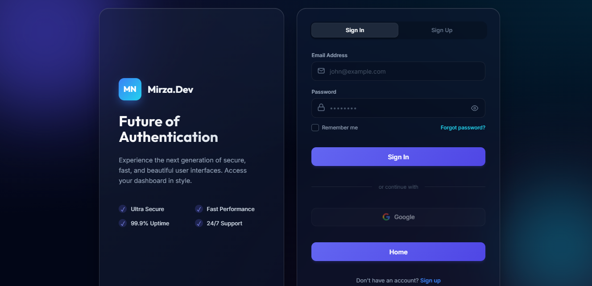
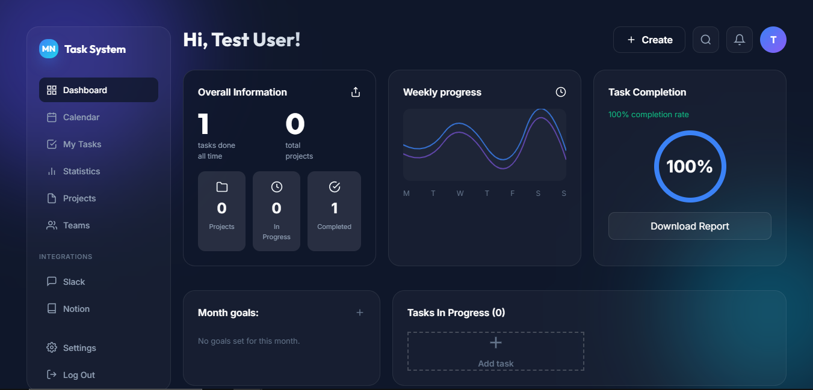

# 🚀 Role-Based Task Management System

A comprehensive Laravel-based project and task management solution with **strict role-based access control (RBAC)**, real-time status tracking, and a modern glassmorphism UI.


---

## 📸 Screenshots

### Login Page


### Admin Dashboard


---

## ✨ Key Features

### 🔐 Role-Based Access Control
- **Admin**: Full system access - create/edit Projects, Teams, Tasks, manage Users and Settings
- **Manager**: Oversee assigned projects and teams
- **Member**: View assigned tasks, mark completion, read-only access

### 📊 Admin Dashboard
- Real-time statistics (Users, Projects, Teams, Tasks)
- Clickable stat cards for quick navigation
- Global announcement system
- System settings management

### 📂 Project & Team Management
- Create teams with multi-member assignment
- Smart filtering (excludes admins from member lists)
- Project-team associations
- Status tracking (Pending, In Progress, Completed)

### ✅ Advanced Task Tracking
- **Multi-user assignment** to single tasks
- **Independent per-user status tracking** - each user's progress is tracked separately
- **Auto-completion logic** - task completes only when ALL assigned users finish
- Detailed timestamps for completion tracking
- Priority levels (High, Medium, Low)
- Due date management

### 🎨 Modern UI/UX
- Glassmorphism design with blur effects
- Fully responsive (Desktop, Tablet, Mobile)
- Dark theme with gradient backgrounds
- Smooth animations and transitions
- Dynamic context-aware navigation

---

## 🛠️ Tech Stack

- **Backend**: Laravel 11.x
- **Frontend**: Blade Templates, Alpine.js
- **Styling**: Custom CSS with Glassmorphism, TailwindCSS
- **Database**: MySQL 8.0
- **Authentication**: Laravel Breeze
- **Icons**: Heroicons (SVG)

---

## 📋 Prerequisites

Before you begin, ensure you have the following installed:

- **PHP** >= 8.2
- **Composer** >= 2.x
- **Node.js** >= 18.x & npm
- **MySQL** >= 8.0
- **Git**

---

## 🚀 Installation

Follow these steps to set up the project locally:

### 1. Clone the Repository

```bash
git clone https://github.com/YOUR_USERNAME/Role-based-Task-Management-System.git
cd Role-based-Task-Management-System
```

### 2. Install Dependencies

```bash
# Install PHP dependencies
composer install

# Install Node dependencies
npm install
```

### 3. Environment Configuration

```bash
# Copy the environment file
copy .env.example .env

# Generate application key
php artisan key:generate
```

### 4. Database Setup

Edit `.env` file with your database credentials:

```env
DB_CONNECTION=mysql
DB_HOST=127.0.0.1
DB_PORT=3306
DB_DATABASE=task_management
DB_USERNAME=root
DB_PASSWORD=your_password
```

Create the database:

```bash
# Login to MySQL
mysql -u root -p

# Create database
CREATE DATABASE task_management;
exit;
```

### 5. Run Migrations & Seeders

```bash
# Run migrations
php artisan migrate

# Seed the database with roles and admin user
php artisan db:seed
```

### 6. Build Assets

```bash
# Compile assets
npm run dev
# OR for production
npm run build
```

### 7. Start Development Server

```bash
php artisan serve
```

Visit: **http://localhost:8000**

---

## 👤 Default Login Credentials

After seeding, use these credentials to log in:

### Admin Account
```
Email: admin@example.com
Password: password
```

### Test User Account
```
Email: user@example.com
Password: password
```

---

## 📁 Project Structure

```
Role-based-Task-Management-System/
├── app/
│   ├── Http/
│   │   └── Controllers/
│   │       ├── AdminController.php
│   │       ├── TaskController.php
│   │       ├── ProjectController.php
│   │       └── TeamController.php
│   └── Models/
│       ├── User.php
│       ├── Task.php
│       ├── Project.php
│       └── Team.php
├── database/
│   ├── migrations/
│   └── seeders/
│       ├── RoleSeeder.php
│       └── AdminUserSeeder.php
├── resources/
│   └── views/
│       ├── admin/
│       ├── tasks/
│       ├── projects/
│       └── teams/
└── public/
    └── css/
```

---

## 🎯 Usage Guide

### For Administrators

1. **Login** with admin credentials
2. Navigate to **Admin Dashboard**
3. **Create Teams** and assign members
4. **Create Projects** for specific teams
5. **Create Tasks** and assign to users
6. **Monitor Progress** via task detail views
7. **Manage Settings** and post announcements

### For Regular Users

1. **Login** with user credentials
2. View **My Tasks** in the sidebar
3. Click on task titles to see details
4. Click **"Mark Complete"** when finished
5. View **completion timestamp** in your profile

---

## 🔧 Configuration

### Timezone

The application is configured for **Asia/Kolkata** timezone. To change:

Edit `config/app.php`:

```php
'timezone' => 'Asia/Kolkata',
```

### Maintenance Mode

Admins can enable/disable maintenance mode from the Settings page, or via CLI:

```bash
# Enable
php artisan down

# Disable
php artisan up
```

---

## 🤝 Contributing

Contributions are welcome! Please follow these steps:

1. Fork the repository
2. Create a feature branch (`git checkout -b feature/AmazingFeature`)
3. Commit your changes (`git commit -m 'Add AmazingFeature'`)
4. Push to the branch (`git push origin feature/AmazingFeature`)
5. Open a Pull Request

---

## 📄 License

This project is open-source and available under the [MIT License](LICENSE).

---

## 📧 Contact

For questions or support, please contact:

- **Email**: najmirza7867@gmail.com
- **GitHub**: https://najmirza.github.io/Mirza/

---

## 🙏 Acknowledgments

- [Laravel](https://laravel.com) - The PHP Framework
- [Alpine.js](https://alpinejs.dev) - Lightweight JavaScript framework
- [TailwindCSS](https://tailwindcss.com) - Utility-first CSS framework

---

**⭐ If you find this project useful, please consider giving it a star!**
